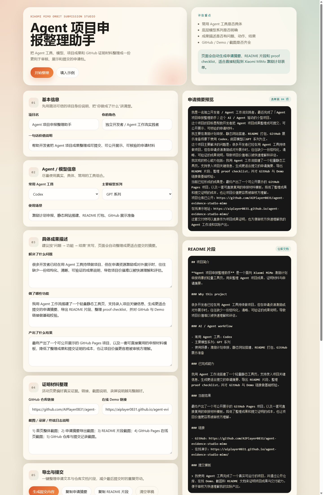

# Agent 项目证据整理生成器

一个面向 **Xiaomi MiMo 激励计划** 的轻量静态工具页，用来整理 Agent 项目成果、证明材料和申请摘要，帮助开发者更快准备可审阅、可验证、可公开展示的提交内容。

An ultra-light static web app for turning an Agent project into a clean submission package: summary text, README snippets, GitHub links, demo links, and proof checklists.

## 项目价值

活动页明确提到评估会看：

- 你常用的 AI / Agent 工具
- 主要使用的底层模型系列
- 项目描述是否具体
- 是否提供可信的证明材料

很多开发者已经有真实成果，但往往卡在“怎么把成果整理成可提交材料”。这个项目就是为这个场景设计的。

## 功能

- 录入项目名、角色、一句话价值说明
- 记录常用 Agent 工具与主要模型系列
- 按“问题 -> 功能 -> 结果”整理成果描述
- 录入 GitHub 仓库链接、Demo 链接和 proof 说明
- 自动生成可直接提交的中文申请摘要
- 自动生成 README 文档片段
- 自动生成 proof checklist
- 使用 `localStorage` 自动保存草稿

## AI / Agent Workflow

- 常用 Agent 工具：Codex / Claude Code / OpenClaw / Cursor 等
- 主要模型系列：GPT / Claude / Gemini / MiMo / DeepSeek 等
- 典型场景：静态站点搭建、文案整理、README 生成、GitHub 发布准备

## 截图

- 封面素材：[assets/cover.svg](./assets/cover.svg)
- 应用截图：[assets/app-screenshot.png](./assets/app-screenshot.png)



## 本地运行

直接双击 `index.html` 即可打开。  
如果你想用本地静态服务预览，可以运行：

```powershell
python -m http.server 4173
```

然后访问 `http://localhost:4173/`

如果你想直接加载示例数据并生成完整导出结果，可以访问：

`http://localhost:4173/?sample=1`

## 在线体验

- GitHub Pages：待发布

## 仓库地址

- GitHub：待发布

## 为什么这是一个 AI / Agent 驱动工作流工具

这个项目不是在线推理产品，而是一个 **Agent 工作流成果整理器**：

- 用 Agent 快速搭建页面结构与交互逻辑
- 用 Agent 整理申请摘要与 README 片段
- 用 Agent 反向约束提交材料结构，保证更贴近评估重点

换句话说，它展示的不是“模型聊天能力”，而是 **AI 辅助交付真实项目与证明材料** 的能力。

## 可复用提交模板

你可以把页面导出的申请摘要作为活动表单第 04 项基础稿，再把下面这段放进 README 或申请描述里：

> 我使用 Agent 工具完成了一个真实可运行的项目，并通过公开 GitHub 仓库、在线 Demo、截图和文档来证明项目成果与交付能力。这个项目本身也服务于成果整理与提交流程，帮助我把 AI / Agent 驱动的实际产出更清晰地展示出来。

## 发布清单

- 公开 GitHub 仓库
- 开启 GitHub Pages
- 在仓库 About 区填写 Demo 链接
- 补充 `assets/app-screenshot.png`
- 准备首页、导出区、终端运行、在线页四类截图作为 proof

## GitHub 发布建议

推荐仓库名：

`agent-evidence-studio-mimo`

推送后本仓库自带 `.github/workflows/pages.yml`，会在 `main` 分支更新后自动部署 GitHub Pages。

如需用 GitHub CLI 创建公开仓库，可参考：

```powershell
gh auth login
gh repo create agent-evidence-studio-mimo --public --source . --remote origin --push
```
